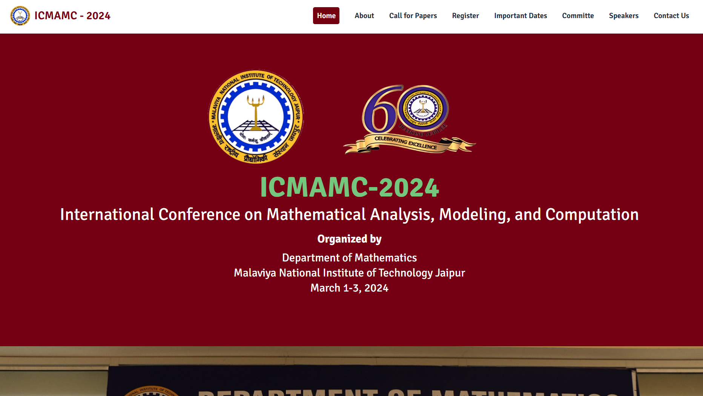
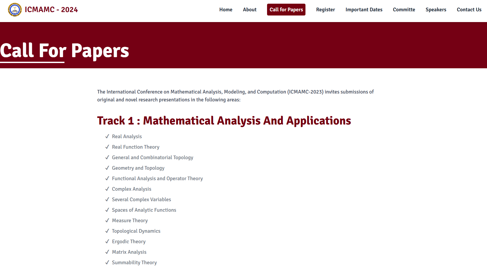

# ICMAMAC

**ICMAMAC** is an event website created for MNIT Jaipur. It is my first official website launched on the internet and is dedicated to a math event. The site provides a countdown to the event and detailed information about it. Built using React and Tailwind CSS, the website is optimized for search engines, offers fast client-side rendering, and is highly responsive across all devices.

### Tech Stack

- **Frontend**: React, Tailwind CSS

### Features

- **SEO**: Optimized for search engines to increase visibility.
- **Performance**: Fast loading times with client-side rendering.
- **Responsiveness**: Highly responsive design for all devices.

### Links

- [Live Demo](https://icmamac.mnitalumni.com/)
